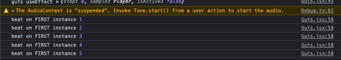
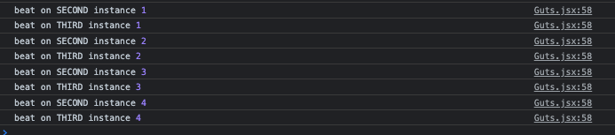

Script getting doubled.

When I resume "play" after refreshig page, the audio playback refers to both current and *all* previous instances of data stored somehwere in memory. Things can get extremely weird, and so isolating behavior is challenging.

Here is a simplistic illustration of of what is going on in console logs. I re-wrote the console logs in guts.jsx in between each page load (all logging at guts.jsx:58)

I believe this has to do with how audio contexts(?) are stacking. I am looking into both Tone and web AudioContext API for ways to close out contexts, but it's tricky!
