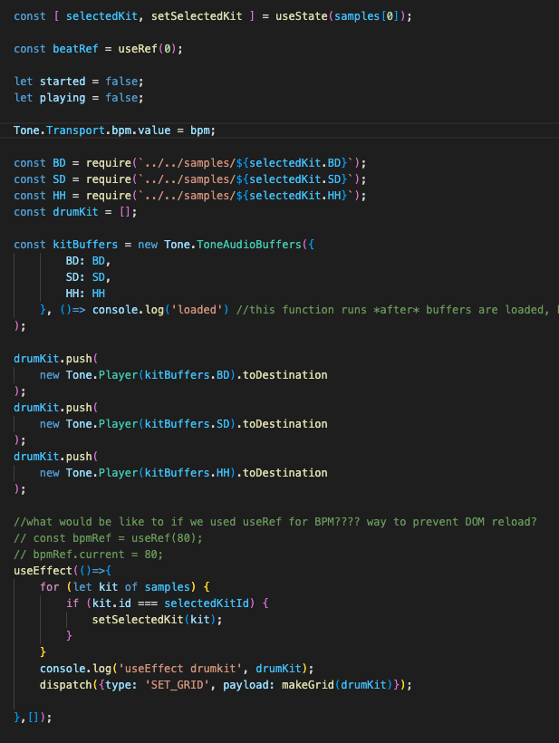
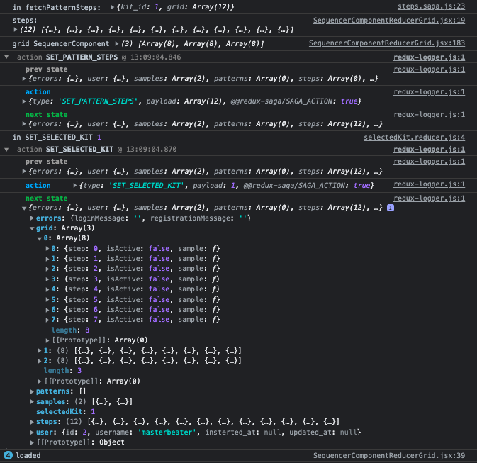

I am struggling to re-work my sequencer so that the 'grid' is stored in REDUX state.

terms:
*STEP DATA*: saved pattern data. needs to be re-formatted for C *RU* D. 
[
    {id: 1, pattern_id: 1, step: 0, BD: true, SD: false, HH: true},
    {id: 2, pattern_id: 1, step: 2, BD: false, SD: false, HH: false},
    ...
]

*GRID*: this is the *active* object that responds to user input and is referenced to trigger sample playback.

[
    [{...},{...},{..}} ...],
    [{...},{...},{...} ...],
    [{...},{...},{...} ...]
]

where {...} = {step: 0, isActive: true, sample: PLAYER}

*PLAYER* this is a tone.js object. it contains information about the sample/buffer, and is object that tone.js triggers/plays. I think the creation of a PLAYER using buffers (another tone.js object is asynchronous)

*DRUMKIT* drumKit is an an array of PLAYERS.

[ BDplayer, SDplayer, HHplayer] 

drumKit is currently defined and created in the component, and references 'selectedKit,' which is an object in redux state containing sample URLS.

CURRENT PROBLEMS:

I want to create a dispatch a new grid to redux state on DOM load.

I dispatch a new grid ( makeGrid(drumKit) ) to the reducer in useEffect (see above image).

The prerequisites for a playable grid is DRUMKIT with players. however, the grid that is defined in my useEffect does not contain 'Players,' it contains function definitions.

should be { ...sample: Player}

Figuring out how to mount component with a functioning, playable GRID set to redux state is the first step in loading saved patterns.
i'm several steps away from reaching full CRUD, and figuring this out may require some *serious* digging into the component guts. want to keep making progress, but feel a need to re-evaluate my game plan. am i reworking guts iteratively? do i have a full plan? How much time should i spend making a plan?